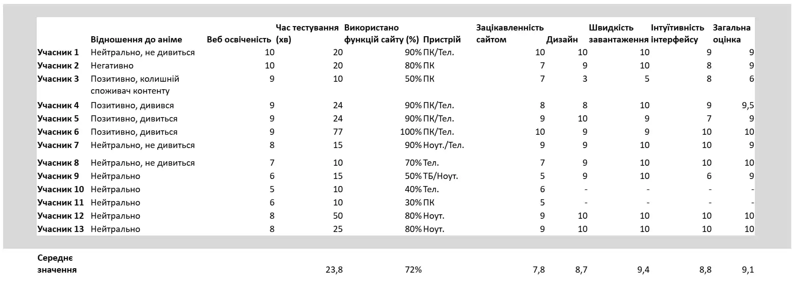
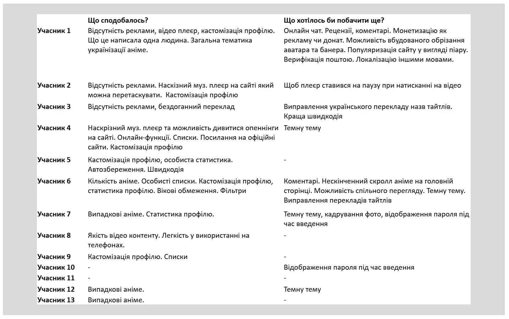
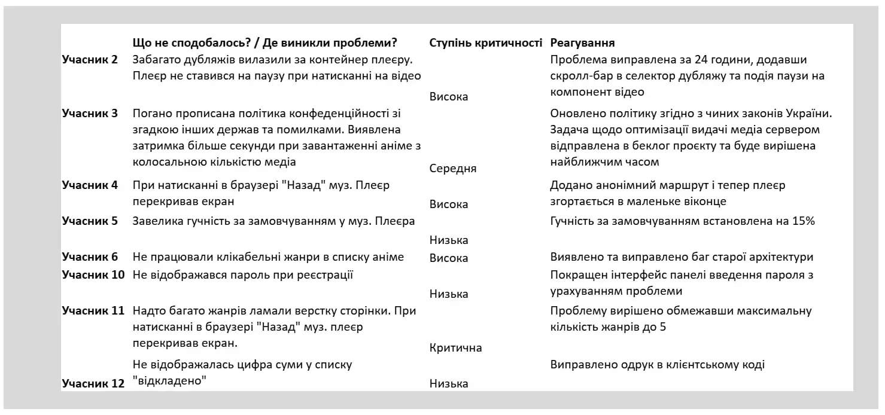

<div align="center">


# 🌸 AniFlow – Агрегатор Українського Аніме Контенту

[](https://aniflow.xyz)
[](LICENSE)

</div>

**AniFlow** – платформа, яка з'явилася з великої любові до аніме та прагнення зробити щось по-справжньому якісне і порадувати українську спільноту. Я починав цей проєкт насамперед для себе, щоб чесно розібратися і навчитися створювати складні та готові до життя системи з нуля. Мені хотілося прибрати весь комерційний хаос та недоліки на подібних сайтах, взяти все найкраще й зробити це ще кращим. Тому кожній, на перший погляд, непомітній дрібниці приділено особливу увагу, любов та полірування. Сподіваюся, я зможу цим репозиторієм показати, що навіть один розробник може створити охайну, зручну та автономну платформу для людей.

**Відвідати сайт та спробувати самостійно можна тут:
<a href="https://aniflow.xyz" target="_blank" rel="noopener noreferrer">
aniflow.xyz
</a>**

<details open>

<summary><h3>Зміст</h3></summary>

---

- [🛠️ Стек](#tech-stack)
- [📸 Галерея](#gallery)
- [⭐ Основні можливості](#features)
- [📖 Про архітектуру](#architecture)
- [✨ Що нового?](#whats-new)
- [💬 Фідбек користувачів](#feedback)
- [🗺️ Плани на розвиток](#roadmap)
- [🚀 Інструкція з запуску](#getting-started)
- [📜 Ліцензія](#license)
- [📩 Зв'язатися](#contacts)

<!-- 🎉 Сюрприз Скоро будуть додані і такі пункти -->

<!-- - [📚 Документація API](#api-documentation) -->
<!-- - [🔧 Інструкція для розробників](#developer-guide) -->

</details>

<details open>
<summary><h2 id="tech-stack">🛠️ Технологічний Стек</h2></summary>

---

### 🖥️ Backend

 <!-- .NET -->
 <!-- ASP.NET -->
 <!-- EF_Core -->
 <!-- FluentValidation -->
 <!-- AutoMapper -->
<!-- Serilog -->

### 💾 Інфраструктура

 <!-- Postgres -->
 <!-- Redis -->
<!-- AWS -->
 <!-- RabbitMQ -->
<!-- SignalR -->
<!-- Seq -->
 <!-- Zoho_Mail -->

### 🎨 Frontend

 <!-- React -->
 <!-- Next.js -->
 <!-- TypeScript -->
 <!-- Tailwind -->

### 🚀 Розгортання

 <!-- Docker -->
 <!-- Nginx -->
 <!-- GitHub -->
 <!-- GitHub Actions -->
 <!-- Hetzner -->

</details>

<details open>
<summary><h2 id="gallery">📸 Галерея</h2></summary>

---

<details open>
<summary><h3>🌸 Основний інтерфейс</h3></summary>

#### 🏠 Головна сторінка

https://github.com/user-attachments/assets/49d416ee-91c3-45b9-9a3c-786c3dbf2e45

<p align="center">
  <a href=".github/assets/readme/home-page-details.webp" target="_blank" rel="noopener noreferrer">
    Дивитися в повному обсязі
  </a>
</p>

<p align="center"><small><i>Динамічна інтеграція актуальних тайтлів поточного сезону, навігація та інтерактивні блоки.</i></small></p>

#### 📂 Каталог

https://github.com/user-attachments/assets/691f3aed-e1f5-4c09-a9d2-8c033bd80c3b


<p align="center">
  <a href=".github/assets/readme/catalog-page-details.webp" target="_blank" rel="noopener noreferrer">
    Дивитися в повному обсязі
  </a>
</p>
<p align="center"><small><i>Розширена фільтрація, сортування, перемикання режимів та тест швидкості завантаження.</i></small></p>

#### 📺 Сторінка Тайтлу

https://github.com/user-attachments/assets/659239de-cf9d-44a4-a641-1d45ef1777d6

<p align="center">
  <a href=".github/assets/readme/anime-page-details.webp" target="_blank" rel="noopener noreferrer">
    Дивитися в повному обсязі
  </a>
</p>
<p align="center"><small><i>Повна інформація про аніме, плеєр із вибором озвучок, пов'язані релізи та інтеграція медіа.</i></small></p>

#### 🎵 Кастомний Музичний Плеєр

https://github.com/user-attachments/assets/85f68f22-479b-45f6-9163-8e4cdf0d95ee

<p align="center">
  <a href=".github/assets/readme/ost-player-page.webp" target="_blank" rel="noopener noreferrer">
    Дивитися в повному обсязі
  </a>
</p>
<p align="center"><small><i>Унікальний OST-плеєр, що продовжує відтворення треків під час переходів між сторінками.</i></small></p>

</details>

<details open>

<summary><h3>👥 Особистий кабінет</h3></summary>

#### 📚 Профіль та списки

https://github.com/user-attachments/assets/5ce19429-473c-4208-9bb9-0754bbbb1da8

<p align="center">
  <a href=".github/assets/readme/profile-page.webp" target="_blank" rel="noopener noreferrer">
    Дивитися в повному обсязі
  </a>
</p>

<p align="center"><small><i>Кастомізація профілю, детальна статистика та списки.</i></small></p>

#### 🤝 Система друзів

https://github.com/user-attachments/assets/16f6aad9-4170-4372-87db-65047e016f92

<p align="center">
  <a href=".github/assets/readme/friends-page.webp" target="_blank" rel="noopener noreferrer">
    Дивитися в повному обсязі
  </a>
</p>
<p align="center"><small><i>Відображення активності та друзів.</i></small></p>

</details>

<details open>
<summary><h3>👑 Панель адміністратора</h3></summary>

#### 📈 Дашборд та метрики

https://github.com/user-attachments/assets/316aaa94-b12f-4391-95f8-ea211b1e9f9c

<p align="center">
  <a href=".github/assets/readme/dashboard-page-details.webp" target="_blank" rel="noopener noreferrer">
    Дивитися в повному обсязі
  </a>
</p>
<p align="center"><small><i>Кастомна адмінка з бізнес-метриками та панелью синхронізації.</i></small></p>

#### 🛠️ Керування контентом

https://github.com/user-attachments/assets/b308c10f-e49e-4135-90fd-ea9c906cc086

<p align="center">
  <a href=".github/assets/readme/anime-edit-page-details.webp" target="_blank" rel="noopener noreferrer">
    Дивитися в повному обсязі
  </a>
</p>
<p align="center"><small><i>Інструменти модерації: контроль над сутностями аніме, жанрами, студіями разом із синхронізацією зв'язків.</i></small></p>

</details>

<details open>
<summary><h3>📱 Мобільна адаптація</h3></summary>

https://github.com/user-attachments/assets/1b702639-e5fe-44c7-a602-ab40294de60a

<p align="center"><small><i>Коротка демонстрація повноцінного мобільного інтерфейсу.</i></small></p>

</details>
</details>

<details open>
<summary><h2 id="features">⭐ Основні можливості</h2></summary>

---

### 🎬 Користувацький досвід

- 🌸 **Головна сторінка** – динамічне відображення популярних тайтлів поточного аніме-сезону.
- 🍿 **Функціональний плеєр** – зручний перегляд із можливістю швидкого вибору серій, різних варіантів озвучок та налаштуваннями відтворення.
- 🎵 **Унікальний OST-плеєр** – кастомний музичний плеєр із наскрізною архітектурою, що дозволяє слухати саундтреки без переривання під час навігації сайтом.
- 🎲 **Рандомайзер** – функція швидкого пошуку випадкового тайтлу для тих, хто не знає, що подивитися.
- 📱 **Повна мобільна адаптація** – інтерфейс повністю оптимізований під будь-які екрани смартфонів та планшетів.

### 🔍 Каталог та сторінки контенту

- 🗂️ **Каталог** – з підтримкою фільтрації, сортування та пагінації контенту із збереженням стану в URL-адресі. Підтримується 3 режими відображення карток-плиток 🍫.
- 📖 **Інтерактивні сторінки тайтлів** – детальна інформація, опис, відображення синонімів назв, галерея скріншотів, а також прямі посилання на офіційні сайти, YouTube-канали та Wikipedia.
- 🔗 **Зв'язані релізи** – зручна система навігації між пов'язаними тайтлами для миттєвого перемикання між сезонами, передісторіями та сиквелами.

### 👥 Соціальні функції та профілі

- 📊 **Персональний профіль** – кастомізація аватара і банера, детальна особиста статистика переглядів та керування списками.
- 📑 **Списки контенту** – можливість оцінювати тайтли, додавати їх до персональних списків («Переглянуто», «У планах» тощо) або зберігати в «Улюблене».
- 🤝 **Соціалізація** – можливість ділитися профілем, додавати інших користувачів у друзі, бачити їхній статус та активність.

### ⚙️ Автоматизація та Адмін-панель

- 🔁 **Автопарсинг та синхронізація** – повністю автоматизована система збору, парсингу та регулярного автооновлення бази даних контенту без втручання розробника.
- 👑 **Адмін-панель** – кастомний кабінет адміністратора з бізнес-метриками для моніторингу стану системи та повного управління додатком.
- 🛠️ **Контроль даних** над усіма сутностями: керування аніме, студіями, жанрами, ручна синхронізація, налаштування зв'язків між сезонами та сортування скріншотів.

</details>

<details open>

<summary><h2 id="architecture">📖 Про архітектуру проєкту</h2></summary>

---

Бекенд-частина платформи спроектована як модульний **моноліт**.

В основі бекенда лежать принципи **Clean Architecture** із чітким розділенням системи на незалежні шари:

- **Api** – зовнішній інтерфейс з контроллерами за конфігурацією додатка, який приймає запити та повертає відповіді.
- **Application** – шар бізнес-логіки.
- **Core** – ядро системи, що містить основні бізнес-сутності та правила.
- **Infrastructure** – інтеграція із зовнішніми сервісами. Наприклад: ExternalAPI, MassTransit, Quartz, AWS S3, Redis.
- **DataAccess** – окремий ізольований шар для безпосередньої взаємодії з базою даних через EF Core.

Вся інфраструктура проєкту разом із фронтендом контейнеризована через **Docker**. Фінальне розгортання реалізовано на виділеному сервері, де як єдина точка входу та зворотний проксі-сервер виступає **Nginx**, який забезпечує маршрутизацію трафіку, кешування та шифрування з'єднань.

### 🖥️ Бекенд

В основі серверної частини лежить моя улюблена мова програмування C#, з якою я вже неодноразово працював, та індустріальний стандарт для вебдодатків – ASP.NET Core Web API.

##### 🗄️ Взаємодія з БД

Використано ORM Entity Framework Core. Для архітектури доступу до даних застосовано патерн Repository. З метою оптимізації впроваджував проекції для завантаження лише необхідних даних замість повної сутності та метод AsNoTracking() для read-only запитів. Також успішно прибирав зайві звернення до БД та проблему N+1 запитів, які мені дісталися у спадок старої архітектури. Для великих колекцій, звісно ж, налаштовано пагінацію та обмеження вибірок.

##### 🔍 Валідація та Мапінг

FluentValidation інтегровано як фільтр валідації на рівні middleware. Мапінг даних розподілений приблизно 50/50 між ручним написанням та AutoMapper, залежно від конкретного контексту та ситуації.

##### 🐘 База даних

Обрано PostgreSQL за її потужність, повну підтримку JSON, open-source статус та ідеальний баланс продуктивності.

##### 📡 Реалтайм

За допомогою SignalR реалізовано трекінг онлайну на сайті з гарантією унікальності сесій як для авторизованих користувачів, так і для гостей.

##### 🔥 Кешування та Метрики

Redis виступає серцем оптимізації. Він використовується для активного кешування більшості даних, що часто запитуються: результатів фільтрації каталогу, сторінок аніме... а також запитів до сторонніх API (що дозволило суттєво розвантажити їх та прискорити відповіді сайту) і профілів користувачів. Окрім цього, в Redis тимчасово зберігаються метрики відвідуваності, переглядів та обчислення онлайну, які згодом благополучно переносяться в основну базу.

Додатково було проведено навантажувальне тестування за допомогою k6. У результаті оптимізації кешування через Redis вдалося скоротити час відповіді системи приблизно у **25 разів** порівняно з конфігурацією без кешу.

##### ☁️ Сховище файлів

Як надійне та розширюване сховище інтегровано AWS S3. Початково проєкт працював на локальному MinIO, але згодом був успішно мігрований у хмару.

##### 📨 Черги та Фонова робота

RabbitMQ відповідає за парсинг та оновлення бази аніме. На розробку алгоритму збору контенту з двох відеохостингів пішов цілий місяць, але результат того вартував: база наповнилася першими **2400 тайтлами всього за 20 хвилин** без жодного збою. Для керування фоновими задачами, такими як перерахунок рейтингу, перевірка новинок та оновлень використано Quartz.

##### 📝 Логування

Безпосередньо, для такої складної системи логування стало гострою необхідністю. Воно побудоване у зв'язці Serilog та Seq, причому доступ до панелі Seq з міркувань безпеки здійснюється суворо через SSH-тунель.

### 🎨 Фронтенд

Клієнтська частина написана на компонентному React, який мені дуже імпонує, та фреймворку Next.js.

<!-- <h5 style="margin-bottom: 0px; padding-bottom: 0px;">🖥️ Рендеринг</h5> -->

##### 🖥️ Рендеринг

Початково фронтенд створювався як класичний SPA, проте через мерехтіння сторінок при завантаженні та низьку ефективність для пошукових роботів, архітектуру було повністю переосмислено. Тепер усі ключові сторінки працюють через суворий SSR (Server-Side Rendering) для якісної SEO-оптимізації. Завдяки Next.js усе побудовано на базі App Router та Island Architecture, а отримання даних є асинхронним там, де це доречно. Також згенеровано динамічну карту сайту (sitemap) для кращої індексації ботами. Перехід на SSR знизив середню швидкість завантаження сторінок на **700 мс**.

##### 🧩 Типізація

Я навмисно обрав TypeScript. Оскільки я звик до суворо типізованих мов, таких як C#, Java.. Нетипізований JS мені не дуже імпонував. З TS банально простіше, швидше та зрозуміліше програмувати: можна бачити помилки ще на етапі компіляції, а не після деплою.

##### 🖌️ Стилізація

Оскільки мені потрібна була максимальна кастомізація інтерфейсу - ідеальним вибором став TailwindCSS. Динаміку та плавність елементів забезпечує бібліотека Motion. Сортування скриншотів реалізовано за допомогою dnd kit, а на бекенді цей функціонал підтримується алгоритмом Fractional Indexing. Для кастомізації специфічних елементів (чекбокси, випадаючі списки тощо..) я не скупився на перевірені рішення на кшталт MUI.

### 🌐 Деплой

##### 🔁 Проксі

Як легкий та зручний зворотний проксі використано Nginx Proxy Manager, де також налаштовано автоматичний випуск SSL-сертифікатів. Поруч із цим я експериментував і з чистим Nginx для глибшого розуміння процесів.

##### 🏢 Сервер

Проєкт розгорнуто на виділеному сервері Hetzner під керуванням Ubuntu 24.04, що дало мені повний контроль над ОС та налаштуванням інфраструктури. Уся адміністрація сервера та робота з інфраструктурою виконуються виключно через захищене SSH-з'єднання.

##### 🐳 Контейнеризація та CI/CD

Усі сервіси ізольовані та контейнеризовані за допомогою Docker із закритими внутрішніми портами.
Повну перевірку коду та доставку додатка на сервер автоматизовано через GitHub Actions, що також звільнило ресурси сервера від постійного навантаження під час збірки проєктів.

##### 🌍 Домен

Як доменного реєстратора обрано Porkbun, де я самостійно конфігурував DNS-записи та поштові сервіси.

##### 🧪 Тестування

Перед фінальним релізом було проведено комплексне тестування за участю **13 реальних користувачів**. Більшість із них взагалі не були пов'язані з розробкою чи аніме-культурою, що допомогло отримати максимально неупереджений фідбек. На основі їхніх відгуків я пофіксив критичні баги, а цікаві ідеї щодо нових фіч відправив у беклог для майбутніх оновлень.

##### 📦 Обсяг

Проєкт має загальний обсяг близько 24 000 рядків коду згідно з метриками `cloc`, без урахування коментарів та сторонніх залежностей: ~14k TypeScript та ~10k C#.

</details>

<details open>
<summary><h2 id="whats-new">✨ Що нового?</h2></summary>

---

### 📜 Оформлення документації та ліцензування

Написано детальний опис проєкту `README.md`, додано ліцензію `LICENSE` та впроваджено систему трекінгу змін `CHANGELOG.md`.

### 🚀 Офіційний запуск та бета-тестування

Платформу успішно розгорнуто в продакшені на серверах Hetzner. Проведено комплексне тестування за участю **13 реальних користувачів**. На основі їхнього фідбеку система пройшла етап стабілізації, було усунуто критичні баги та оптимізовано загальну роботу додатка.

### 👥 Соціалізація та система друзів

Розроблено повноцінний соціальний блок: від логіки БД на бекенді до інтерактивного UI на фронтенді. Користувачі тепер можуть надсилати запити у друзі, отримувати сповіщення в шапці сайту, ділитися своїми профілями та переглядати колекції аніме інших людей!

### 🟢 Система онлайну

Впроваджено трекінг активності користувачів та гостей сайту за допомогою **SignalR**. Система гарантує унікальність сесій, кешує проміжний статус в **Redis** та відображає бейджі активності на фронтенді, фіксуючи час останнього візиту.

ℹ️ _З повним списком усіх попередніх змін, ви можете ознайомитися у файлі_ <a href="./CHANGELOG.md" target="_blank" rel="noopener noreferrer">📄CHANGELOG</a>

</details>

<details open>
<summary><h2 id="feedback">💬 Фідбек користувачів</h2></summary>

---

Перед фінальним релізом було проведено комплексне UX/UI тестування інтерфейсу та стабільності системи за участю фокус-групи з реальних користувачів. При цьому лише **14%** учасників регулярно переглядають аніме, тоді як **43%** раніше ніколи не взаємодіяли з аніме-контентом, що дозволило отримати максимально об'єктивний фідбек.

### 📊 Ключові середні показники:

- ⭐ **Загальна оцінка проєкту:** `9.1 / 10`
- 🔥 **Швидкість завантаження сторінок:** `9.4 / 10`
- 🧠 **Інтуїтивність інтерфейсу та UX:** `8.8 / 10`
- 🎨 **Візуальний дизайн та UI:** `8.7 / 10`
- ⌛️ **Середній час активного тестування:** `23.8 хв`

### 💡 Що найбільше сподобалося користувачам:

- **Кастомізація та персоналізація профілів**, наявність особистої статистики та інтерактивних онлайн-функцій.
- **Випадковий контент** який розв'язує проблему тривалого пошуку серіалу на вечір.
- **Наскрізний музичний плеєр** із можливістю перетягування.
- **Загальна спрямованість на українізацію** аніме контенту.

### 🛠️ Робота з помилками та реакція на критичний фідбек:

Тестування допомогло виявити кілька технічних нюансів, які були оперативно усунуті:

1. **Поведінка плеєра:** Виправлено проблему перекриття екрана при натисканні кнопки "Назад" у браузері (впроваджено роутинг `#player`).
2. **Адаптивність верстки:** Виправлено баг із випаданням довгих списків дубляжу за межі контейнера та обмежено максимальну кількість жанрів для збереження сітки інтерфейсу.

---

### 📂 Повні звіти та аналітика тестування

<details>
<summary>📈 Таблиця 1: Оцінки користувачів</summary>

Повна статистика оцінювання дизайну, швидкості та юзабіліті кожним учасником.



</details>

<details>
<summary>📝 Таблиця 2: Детальні відгуки та побажання</summary>

Що користувачам найбільше сподобалося, а також їхні пропозиції щодо покращення платформи.



</details>

<details>
<summary>⚡ Таблиця 3: Аналіз проблем та виконані виправлення</summary>

Журнал виявлених проблем, їхньої пріоритетності та виконаних дій для усунення.



</details>

</details>
<details open>
<summary><h2 id="roadmap">🗺️ Плани на розвиток</h2></summary>

---

Розвиток платформи не зупиняється на першому релізі. На основі зібраного фідбеку від користувачів та власного бачення продукту, сформовано наступний беклог завдань на найближче майбутнє:

### 👥 Побажання користувачів

- 🌙 **Повноцінна темна тема** – впровадження нічного режиму для комфортного перегляду контенту в темний час доби та зниження навантаження на зір.
- 💬 **Система рецензій та розгорнутих коментарів** – додавання текстових блоків під сторінками тайтлів для посилення соціальної взаємодії та обміну думками.
- 🍿 **Спільний перегляд** – реалізація кімнат для синхронного перегляду аніме з друзями в реальному часі.
- ✂️ **Інструмент кадрування** – додавання зручного редактора для обрізання та масштабування аватарів і банерів під час завантаження у профіль.

_Я, звичайно-ж, повністю поділяв ці погляди ще до початку тестування, а відгуки користувачів лише підтвердили правильність обраного вектора)_

### ⚙️ Плани розробника

- 🏆 **Інтерактивна система Тір-лістів** – унікальна фіча, яка дозволить користувачам створювати власні візуальні рейтинги улюблених тайтлів, ділитися ними у профілі та порівнювати з вибором друзів, що значно підвищить залученість аудиторії.
- 🔍 **Інтеграція Elasticsearch** – переведення системи пошуку аніме на повноцінний пошуковий двигун. Це дозволить реалізувати миттєвий нечіткий пошук з урахуванням друкарських помилок, синонімів та транслітерації, а також значно знизить навантаження на основну БД.
- 🎬 **Розширення джерел відео контенту** – наразі платформа успішно взаємодіє з MoonPlayer, проте для забезпечення максимальної відмовостійкості системи планується інтеграція додаткових хостингів – Kodik та інших плеєрів з українською локалізацією.

</details>

<!-- <details open>
<summary><h2 id="api-documentation">📚 Документація API</h2></summary>

---

Бекенд-платформа має задокументовану REST API архітектуру, розроблену за стандартами OpenAPI 3.0. Swagger UI вимкнений в продакшен-середовищі та відсутній у публічному доступі.

Водночас, ви можете ознайомитися зі структурою ендпоінтів без необхідності клонування проєкту:

- 📄 **Файл:** Повна схема API доступна у файлі <a href="./swagger.json" target="_blank" rel="noopener noreferrer">swagger.json</a>.
- 🌐 **Інтерактивний перегляд:** Ви можете в один клік відкрити цей файл у візуальному веб-інтерфейсі через <a href="https://editor.swagger.io/?url=https://raw.githubusercontent.com/Ephtianura/AniFlow/main/swagger.json" target="_blank" rel="noopener noreferrer">Swagger Editor</a> або <a href="https://api.scalar.com/scalaris?url=https://raw.githubusercontent.com/Ephtianura/AniFlow/main/swagger.json" target="_blank" rel="noopener noreferrer">Scalar Viewer</a>.
</details> -->

<details open>
<summary><h2 id="getting-started">🚀 Інструкція з запуску</h2></summary>

---

Для швидкого локального розгортання всього оточення проєкту вам знадобиться лише кілька хвилин та встановлений Docker🐳.

### 📋 Попередні вимоги

1. 🐳 Встановити та запустити <a href="[https://www.docker.com/](https://www.docker.com/)" target="_blank" rel="noopener noreferrer">Docker / Docker Desktop</a>.
2. 👾 Встановити <a href="[https://git-scm.com/](https://git-scm.com/)" target="_blank" rel="noopener noreferrer">Git</a> для клонування репозиторію. _(Опціонально)_

### 🛠️ Покроковий запуск

1. **Клонуйте репозиторій** на свій комп'ютер та перейдіть у корінь проєкту:

   ```bash
   git clone https://github.com/Ephtianura/AniFlow
   ```

   ```bash
   cd AniFlow
   ```

2. **Налаштуйте змінні середовища:** Створіть файл конфігурації `.env` у корені проєкту на основі прикладу `env.example`.
   _(Або просто перейменуйте)_.

3. **Запустіть Docker-контейнери:** Виконайте наступну команду в консолі для підняття всіх сервісів:

   ```bash
   docker compose --env-file .env -f docker-compose.yml -f docker-compose.dev.yml up -d --build
   ```

4. **Готово:** Через деякий час, необхідний для ініціалізації баз даних та збирання додатків, вебсайт стане доступним у вашому браузері за адресою: <a href="http://localhost:3000" target="_blank" rel="noopener noreferrer">http://localhost:3000</a>.

ℹ️ _Зі списками та призначенням усіх інших портів інфраструктурних сервісів ви можете детально ознайомитися безпосередньо у файлі
<a href="./docker-compose.dev.yml" target="_blank" rel="noopener noreferrer">`docker-compose.dev.yml`</a>_

</details>

<!-- <details open>
<summary><h2 id="developer-guide">🔧 Інструкція для розробників</h2></summary>

---

</details> -->

<details open>
<summary><h2 id="license">📜 Ліцензія</h2></summary>

---

Цей проєкт є відкритим для перегляду, вивчення та дослідження. Ви можете вільно створювати форки для особистого використання та пропонувати свої покращення через Pull Requests.

**Заборонено:** використовувати код або його частини у комерційних продуктах, запускати публічні копії, створювати конкурентні рішення, а також копіювати чи поширювати модифікований код без дозволу автора.

Детальніше з повним текстом та усіма умовами використання можна ознайомитися у файлі <a href="./LICENSE" target="_blank" rel="noopener noreferrer">LICENSE</a>.

</details>

<details open>
<summary><h2 id="contacts">📩 Зв'язатися</h2></summary>

---

- **AniFlow**, звичайно ж, підтримує офіційну пошту, тому для технічних звітів, пропозицій чи фідбеку можете сміливо сюди писати: <a href="mailto:info@aniflow.xyz" target="_blank" rel="noopener noreferrer">info@aniflow.xyz</a> 🤗

- А для зв'язку безпосередньо з власником проєкту усі актуальні особисті контакти та соцмережі ви можете знайти на сторінці профілю <a href="https://github.com/Ephtianura" target="_blank" rel="noopener noreferrer">@Ephtianura</a>.

Буду радий будь-якому конструктивному фідбеку та цікавим пропозиціям!

</details>
